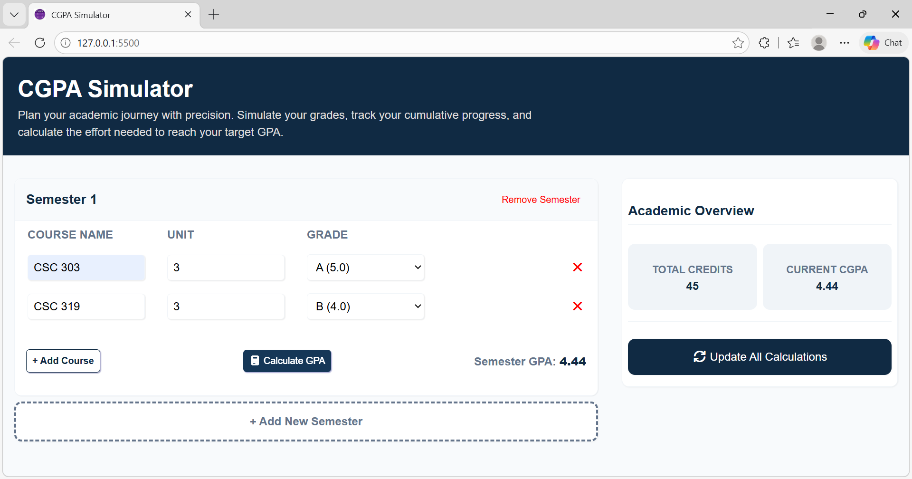

# CGPA Simulator

A simple web application that calculates a student's CGPA based on course units and grades.

It supports both 5.0 and 4.0 grading systems.

Built as a learning project while practicing HTML, CSS, and JavaScript.

## Project Status

In Progress – this project is still being improved.

## Screenshot

## Features

- Add courses
- Delete courses
- Allows editing of courses
- Calculate CGPA

## How to Use

1. Enter course units and grades
2. Add courses
3. Click calculate

## Technologies Used

- HTML
- CSS
- JavaScript

## Future Improvements

- Add GPA classification (First Class, Second Class, etc.)
- Add functionality to the "add new semester" and "update all calculations" buttons
- Calculate CGPA by getting few details about previous semesters
